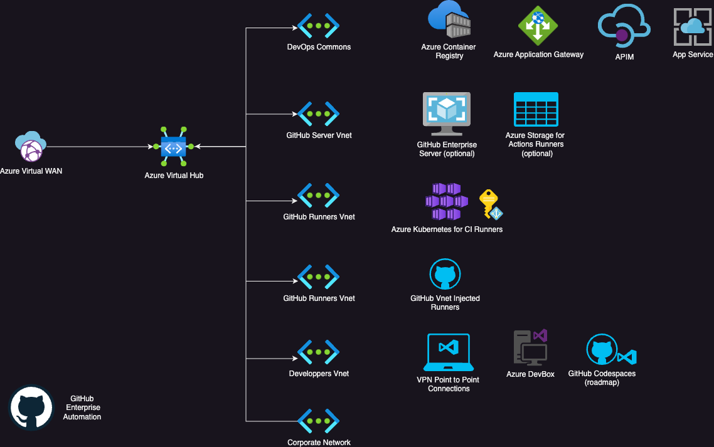

# Development Factory

Welcome to the Dev Factory project!

## Introduction

The Development Factory project is designed to streamline the setup and configuration of a modern development environment build on GitHub Enterprise. 
This project leverages multiple techniques orchestrated with Terraform to automate the provisioning of various components.

The initial north star for this project is to build a development factory represented in the following architecture diagram:



The initial variations are:

1. Private environment.
2. Private environment hardened with private endpoints.

## Components

The dev factory automates the setup the following components:

### Control plane

- GitHub Enterprise Automation (organizations parameters, actions settings, etc.)
- GitHub Hosted Compute Networking
- Azure Kubernetes Services for GitHub Runners with Actions Runner Controller
- Azure Container Registry
- Azure DevBox

### AI foundations (roadmap)

- Azure Application Gateway
- Azure Container Apps
- Azure Container Registry
- Azure Kubernetes Services
- Azure Cognitive Services

## Getting Started

To get started with the DevFactory project, follow these steps:

1. Clone this repository to your local machine, or Click on "Open in Codespace"
2. Login to your Azure Subscription using ```az login```
3. Login to your GitHub Enterprise environment
4. Customize the variables in ```example.tfvars```
5. Run ```terraform plan``` to preview the changes that will be applied.


## Contributing

This project welcomes contributions and suggestions.  Most contributions require you to agree to a
Contributor License Agreement (CLA) declaring that you have the right to, and actually do, grant us
the rights to use your contribution. For details, visit https://cla.opensource.microsoft.com.

When you submit a pull request, a CLA bot will automatically determine whether you need to provide
a CLA and decorate the PR appropriately (e.g., status check, comment). Simply follow the instructions
provided by the bot. You will only need to do this once across all repos using our CLA.

This project has adopted the [Microsoft Open Source Code of Conduct](https://opensource.microsoft.com/codeofconduct/).
For more information see the [Code of Conduct FAQ](https://opensource.microsoft.com/codeofconduct/faq/) or
contact [opencode@microsoft.com](mailto:opencode@microsoft.com) with any additional questions or comments.

## Trademarks

This project may contain trademarks or logos for projects, products, or services. Authorized use of Microsoft 
trademarks or logos is subject to and must follow 
[Microsoft's Trademark & Brand Guidelines](https://www.microsoft.com/en-us/legal/intellectualproperty/trademarks/usage/general).
Use of Microsoft trademarks or logos in modified versions of this project must not cause confusion or imply Microsoft sponsorship.
Any use of third-party trademarks or logos are subject to those third-party's policies.
